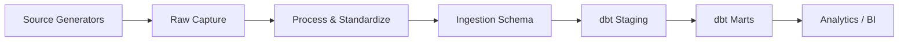

# B2B E-commerce Data Platform
[](https://dagster.io/)
[](https://www.getdbt.com/)
[](https://motherduck.com/)

Monorepo for synthetic source generation, ETL orchestration, and analytics modeling for a B2B ecommerce platform.

This project is a full data platform simulation for B2B ecommerce operations. It is designed to model how production-grade data systems behave over time: sources evolve, data is ingested incrementally, and analytics models are rebuilt reliably for reporting and decision support.

Core purpose:
1. Provide realistic, reusable B2B datasets.
2. Demonstrate end-to-end data engineering patterns in one codebase.
3. Support development, testing, and portfolio demos of modern ELT workflows.

What it is capable of:
1. Generates relational and file-based source data with temporal behavior and business dynamics.
2. Runs stateful ETL with watermarks, manifests, checkpoints, and idempotent loading.
3. Builds tested dbt staging and marts models on top of ingestion outputs.
4. Runs locally with DuckDB or against MotherDuck with config-only changes.
5. Supports orchestration-first execution via Dagster and script-level execution for debugging.

## Tech Stack


## Repository Components
| Component | Path | Purpose |
| --- | --- | --- |
| Source Generators | `packages/b2b_ec_sources` | Generates synthetic source data (Postgres baseline, marketing leads CSV, webserver logs JSONL). |
| ETL Orchestration | `b2b_ec_etl` | Runs Dagster jobs for ingestion (`raw -> process -> load`) and analytics execution. |
| Warehouse Models | `b2b_ec_warehouse` | dbt project with `staging` and `marts` models (dimensions and facts). |
| Shared Utilities | `packages/b2b_ec_utils` | Common settings, storage abstraction, logging, and timing utilities. |

## End-to-End Architecture



## Quickstart (uv)

```bash
# from repo root
uv sync --all-packages
```

Generate source datasets:

```bash
uv run python packages/b2b_ec_sources/src/scripts/generate_all.py
```

Start Dagster (ETL + dbt assets):

```bash
cd b2b_ec_etl
uv run dg dev
```

Build dbt directly (optional):

```bash
# from repo root
uv run dbt build --project-dir b2b_ec_warehouse --profiles-dir .dbt --target dev
```

## PostgreSQL Setup (Aiven Cloud)
The source generators and ingestion raw-capture read from PostgreSQL. For Aiven Cloud, configure:
1. `POSTGRES_HOST`
2. `POSTGRES_PORT`
3. `POSTGRES_USER`
4. `POSTGRES_PASSWORD`
5. `POSTGRES_DATABASE`
6. `POSTGRES_SSLMODE=require` (recommended for Aiven)
7. `POSTGRES_SSLROOTCERT=<path-to-ca.pem>` (optional, for `verify-ca` / `verify-full`)

Quick connectivity check:

```bash
uv run python -c "from b2b_ec_sources import get_connection; c=get_connection(); print('Postgres connection OK'); c.close()"
```

## MinIO Setup (Local Object Storage)
This repository uses MinIO as an S3-compatible storage backend for:
1. Source files (`marketing` CSV and `webserver` JSONL).
2. ETL raw/processed parquet artifacts.
3. ETL metadata (watermarks, run manifests, lineage checkpoints/snapshots).

Start MinIO:

```bash
docker compose up -d minio
```

MinIO endpoints:
1. API: `http://localhost:9000`
2. Console: `http://localhost:9001`

Required `.env` keys for MinIO mode:
1. `STORAGE_LOCATION=minio`
2. `STORAGE_MINIO_ENDPOINT_URL=http://localhost:9000`
3. `STORAGE_MINIO_ROOT_USER=<your-user>`
4. `STORAGE_MINIO_ROOT_PASSWORD=<your-password>`

Create/verify buckets used by the platform:

```bash
uv run python packages/b2b_ec_utils/src/b2b_ec_utils/storage.py
```

## Environment Notes
1. `MOTHERDUCK_TOKEN` is required for MotherDuck target (`dev` in `.dbt/profiles.yml`).
2. `INGESTION_LOAD_SCHEMA` controls the warehouse source schema consumed by dbt (default `ingestion`).
3. Storage and Postgres settings are configured via `.env` and loaded through `b2b_ec_utils.settings`.

## Package Docs
1. [ETL README](b2b_ec_etl/README.md)
2. [ETL Architecture Notes](b2b_ec_etl/ETL.md)
3. [Warehouse README](b2b_ec_warehouse/README.md)
4. [Sources README](packages/b2b_ec_sources/README.md)
5. [Utils README](packages/b2b_ec_utils/README.md)
