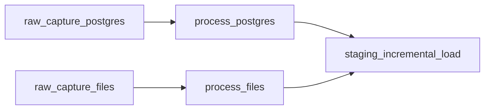
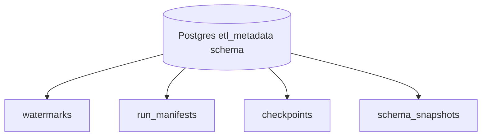
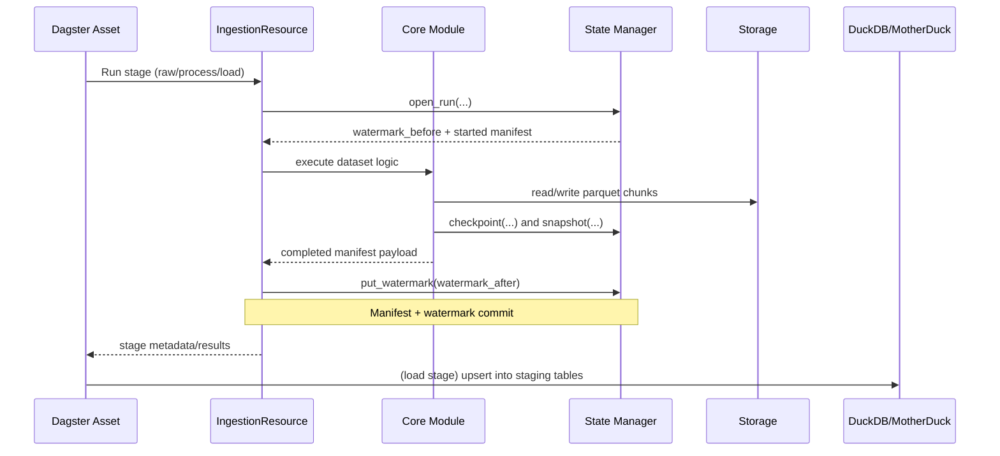

# ETL Architecture
[](https://dagster.io/)
[](https://img.shields.io/)
[](https://motherduck.com/)

## What This ETL Means

This ETL is a **stateful, incremental data platform** that moves data from three source families into an analytics-ready warehouse:

- Relational source tables in Postgres.
- File-based sources (marketing CSV and web logs JSONL).
- dbt models on top of loaded staging data.

The key idea is not only "move data", but "move data **safely and repeatedly**":

- Every stage is tracked with manifests, checkpoints, snapshots, and watermarks.
- Incremental logic is explicit per dataset.
- Each run can continue from the last known good state.

## Dagster Orchestration Model

The package is split into three definition groups under `src/b2b_ec_etl/defs/`:

- `generation`: synthetic source data creation.
- `ingestion`: raw capture -> process -> load.
- `analytics`: dbt build and source assets.

Top-level `definitions.py` uses `load_from_defs_folder(...)` so each group remains modular.

### Ingestion DAG



## Component-by-Component Techniques and Intuition

| Component | Techniques Used | How It Is Implemented | Intuition |
|---|---|---|---|
| `defs/generation` | Resource-driven generation, dependency ordering | `source_db_generation` runs first, then file generators depend on it (`deps=[source_db_generation]`) | Guarantees files are generated against a valid/updated relational baseline |
| `defs/ingestion/asset.py` | Asset-level stage decomposition | Separate assets for raw capture, process, and load with explicit dependencies | Clear observability and rerun boundaries per stage |
| `defs/ingestion/resources.py` | Orchestrator pattern, fail-soft + optional fail-fast, manifest fallback | `IngestionResource` composes pipeline functions, catches per-dataset exceptions, can continue unless `fail_fast=True`, can resolve latest manifests from state when inputs are missing | Keeps orchestration logic centralized and operationally resilient |
| `packages/b2b_ec_pipeline/ingestion/models.py` | Typed contracts with Pydantic + config-driven dataset specs | Domain rows, manifests, plus `POSTGRES_TABLE_CONFIGS`, `FILE_PROCESS_SPECS`, `FILE_LOAD_SPECS` | Business logic becomes data-driven and easier to extend without rewriting control flow |
| `packages/b2b_ec_pipeline/ingestion/postgres_raw.py` | Incremental extraction by watermark mode, bounded window extraction, chunked reads | Supports `full_snapshot`, `incremental_timestamp`, `incremental_id`; computes high watermark, queries `(low, high]`, writes chunked parquet | Prevents reprocessing old rows and keeps memory bounded |
| `packages/b2b_ec_pipeline/ingestion/file_raw.py` | File cursoring, filename timestamp parsing, streaming JSONL chunk parser | Tracks `(cursor_ts, cursor_file)`, discovers only new files, reads JSONL in blocks/chunks, persists checkpoints | Efficient file ingestion with restart safety and deterministic progression |
| `packages/b2b_ec_pipeline/ingestion/process.py` | Schema normalization, required-field validation, type coercion, dedupe, chunked writes | Ensures model columns exist, drops required-null rows, applies preprocessors, dedupes by keys and sort column, writes processed chunks | Converts messy raw inputs into trusted, typed, analytics-safe datasets |
| `packages/b2b_ec_pipeline/ingestion/staging.py` | Idempotent upsert pattern with temp tables, multi-target loads | Registers in-memory Arrow tables, deletes matching PK rows, inserts new rows, supports `full_snapshot` replacement | Enables repeated loads without duplicate accumulation |
| `packages/b2b_ec_pipeline/state/manager.py` | Metadata-backed state machine | Writes/reads watermarks, manifests, checkpoints, schema snapshots in `etl_metadata` Postgres schema | Enables resumability, lineage, and post-run diagnostics |
| `defs/analytics` | Dagster-dbt integration | `@dbt_assets` runs `dbt build`; translator maps dbt sources into Dagster `SourceAsset`s | Keeps transformation layer declarative while still orchestrated inside Dagster |

## Incremental Strategy Matrix

### Postgres Datasets

| Dataset | Mode | Watermark Column | Primary Key |
|---|---|---|---|
| `ref_countries` | `full_snapshot` | N/A | `code` |
| `companies` | `incremental_timestamp` | `updated_at` | `cuit` |
| `products` | `incremental_timestamp` | `updated_at` | `id` |
| `company_catalogs` | `incremental_timestamp` | `updated_at` | `company_cuit, product_id` |
| `customers` | `incremental_timestamp` | `created_at` | `id` |
| `orders` | `incremental_timestamp` | `updated_at` | `id` |
| `order_items` | `incremental_id` | `id` | `id` |

### File Datasets

| Dataset | Raw Capture Strategy | Process Dedupe | Load Targets |
|---|---|---|---|
| `marketing_leads` | New-file discovery by filename timestamp + tie-breaker path | `lead_id` with `status_updated_at` sort | `marketing_leads_current`, `marketing_leads_history` |
| `webserver_logs` | Seed + daily JSONL pattern discovery, block/chunk parsing | `event_id` with `event_ts` sort | `webserver_logs` |

## Watermarks, Manifests, and Lineage

This ETL treats metadata as a first-class subsystem:

- **Watermark**: "How far did we ingest?"
- **Run manifest**: "What happened in this run?"
- **Checkpoint**: "Where inside the run did we reach?"
- **Schema snapshot**: "What shape did the data have?"



### Per-dataset Lifecycle



## Core Design Intuition

### Why split raw/process/load?

- **Raw** preserves source fidelity and replayability.
- **Process** is where schema and quality rules are applied.
- **Load** handles warehouse serving constraints (upsert/full refresh semantics).

This separation makes reruns cheap:

- You can rerun `process` from existing raw files.
- You can rerun `load` from existing processed files.
- You do not need to recapture source data unless needed.

### Why manifests are passed between stages?

The pipeline avoids broad filesystem scans by passing exact `raw_paths` and `processed_paths` in manifests.  
That makes stage boundaries deterministic and faster.

### Why watermark commit is controlled by orchestrator methods?

`IngestionResource` allows `commit_watermarks=False` in inner calls and commits once in outer composed calls (`raw_capture_all`, `process_all`, `load_all_to_staging`).  
This avoids duplicate or out-of-order watermark commits.

### Why both fail-soft and fail-fast modes?

- Fail-soft (default): one dataset can fail without blocking all others.
- Fail-fast: useful in stricter environments where partial success is unacceptable.

Operationally, this gives one codebase for both exploratory and strict production modes.

## Storage and Warehouse Portability

The storage layer (`b2b_ec_utils.storage`) abstracts filesystem operations through `fsspec`:

- Local filesystem.
- S3/MinIO.
- GCS.

The warehouse URI resolver in ingestion resources chooses:

- MotherDuck when token is configured.
- Local DuckDB otherwise.

Intuition: same ETL logic should run locally and in cloud with config-only changes.

## Data Quality and Contract Enforcement

Key quality techniques in `packages/b2b_ec_pipeline/ingestion/process.py`:

- **Model column alignment**: missing columns are added as nulls to match contract.
- **Required field filtering**: records violating required fields are dropped and counted.
- **Type normalization**: datetime/boolean/numeric coercions.
- **Deterministic dedupe**: by business keys and recency sort field.

This ensures staging tables receive consistent schemas even when source files evolve or have dirty rows.

## Observability and Debuggability

Observability is layered:

- Dagster asset metadata (`records`, `bad_records`, `loaded_rows`).
- Component loggers (`IngestionResource`, `PostgresRawIngestion`, `FileRawIngestion`, `ProcessIngestion`, `StagingLoad`, runner loggers).
- Metadata artifacts for forensic replay (manifests/checkpoints/snapshots/watermarks).

This combination gives both high-level and deep operational visibility.

## Operational Entry Points

### Dagster jobs

- Generation job: `data_generation_simulation_job`
- Ingestion job: `data_ingestion_job`
- Analytics job: `data_transformations_job`

### Script runners

- `defs/ingestion/scripts/raw_capture_runner.py`
  - `run_raw_capture`
  - `run_raw_capture_and_process`
  - `run_process_only`
- `defs/ingestion/scripts/load_runner.py`
  - `run_load_only`

### Metadata reset support

`scripts/reset/reset_ingestion_metadata.py` can selectively clear metadata for chosen stages (for replay scenarios).

## Quick Run Commands (uv)

```bash
# From repository root
uv sync

# Start Dagster UI
cd b2b_ec_etl
uv run dg dev

# Optional: run dbt directly
uv run dbt build --project-dir b2b_ec_warehouse --profiles-dir .dbt
```

## Practical Mental Model

If you remember only one thing, use this:

1. **Capture** new source deltas into immutable raw parquet.
2. **Standardize** and validate into processed parquet.
3. **Serve** into staging tables with idempotent writes.
4. **Track everything** with manifests, checkpoints, snapshots, and watermarks.

That is the architectural backbone of this ETL.
