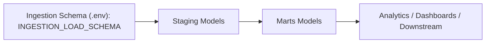

# B2B E-commerce Warehouse (dbt)
[](https://www.getdbt.com/)
[](https://motherduck.com/)
[](https://docs.getdbt.com/)

dbt project for transforming ETL-loaded ingestion tables into analytics-ready staging and marts models.

## Architecture



## Schema Layout
1. Source schema: `{{ env_var('INGESTION_LOAD_SCHEMA', 'ingestion') }}`
2. Staging schema: `staging` (normalized business-ready views)
3. Marts schema: `marts` (dimensions + facts)
4. Base/default schema in profile: `raw` (for compatibility and seeds)

## Model Inventory

Staging models:
1. `stg_ref_countries`
2. `stg_companies`
3. `stg_products`
4. `stg_company_catalogs`
5. `stg_customers`
6. `stg_orders`
7. `stg_order_items`
8. `stg_marketing_leads_current`
9. `stg_marketing_leads_history`
10. `stg_webserver_logs`

Marts dimensions:
1. `dim_datetime`
2. `dim_countries`
3. `dim_companies`
4. `dim_customers`
5. `dim_products`

Marts facts (Incremental):
1. `fct_company_catalog_prices`
2. `fct_orders`
3. `fct_order_items`
4. `fct_marketing_leads_current`
5. `fct_marketing_leads_history`
6. `fct_webserver_logs`

## Run Commands (uv)

```bash
# from repository root
uv sync

# validate profile and connection
uv run dbt debug --project-dir b2b_ec_warehouse --profiles-dir .dbt --target dev

# full build (models + tests)
uv run dbt build --project-dir b2b_ec_warehouse --profiles-dir .dbt --target dev
```

Run selectively:

```bash
# only staging layer
uv run dbt build --project-dir b2b_ec_warehouse --profiles-dir .dbt --target dev --select staging

# only marts layer
uv run dbt build --project-dir b2b_ec_warehouse --profiles-dir .dbt --target dev --select marts
```

Use local DuckDB instead of MotherDuck:

```bash
uv run dbt build --project-dir b2b_ec_warehouse --profiles-dir .dbt --target local
```

## Required Environment
1. `MOTHERDUCK_TOKEN` (when using `--target dev`)
2. `INGESTION_LOAD_SCHEMA` (optional override, defaults to `ingestion`)
3. `DUCKDB_PATH` (optional when using `--target local`)
