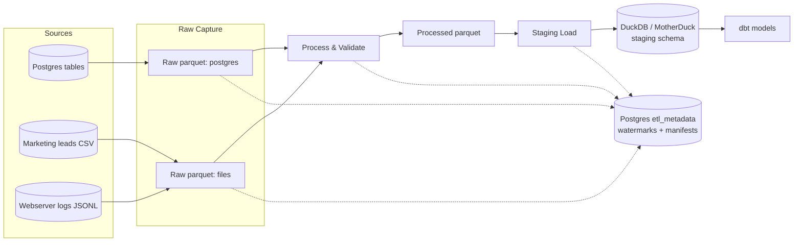
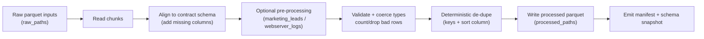
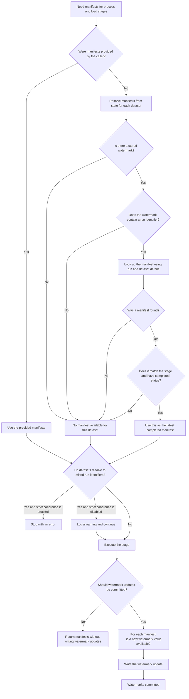

# B2B E-commerce Pipeline (Core Ingestion)

Core ingestion pipeline package (state, metadata, and execution primitives) with **no Dagster dependency**.
Dagster assets in [`b2b_ec_etl`](../../b2b_ec_etl/README.md) call into this package.

## High-Level Flow

## What It Provides
1. **Raw capture**
   - Incremental extraction from Postgres (`full_snapshot`, `incremental_timestamp`, `incremental_id`)
   - File capture/cursoring for marketing leads (CSV) and webserver logs (JSONL)
   - Writes raw parquet to the configured storage backend
2. **Process**
   - Schema alignment to typed contracts (Pydantic models)
   - Validation + bad record counting
   - Deterministic de-dupe (file-level or dataset-level)
3. **Load**
   - Idempotent upsert into DuckDB/MotherDuck staging tables
   - Full-snapshot replacement support for selected targets
4. **State + metadata**
   - Watermarks, run manifests, checkpoints, and schema snapshots stored in Postgres (`etl_metadata` schema)
   - Optional cold-archive writes for audit/replay (via the snapshot/archive writer)

## Process Stage (High Level)

## Metadata Watermark + State Resolver Decisions

## Package Layout
### `src/b2b_ec_pipeline/ingestion/`
- `postgres_raw.py`: extract source tables to raw parquet chunks
- `file_raw.py`: discover/capture new source files into raw parquet
- `process.py`: normalize/validate/dedupe raw datasets into processed parquet
- `staging.py`: load processed parquet into staging tables (DuckDB/MotherDuck)
- `models.py`: typed domain models + dataset specs used by raw/process/load

### `src/b2b_ec_pipeline/state/`
- `bootstrap.py`: creates/ensures the `etl_metadata` schema and tables
- `state_manager.py`: read/write watermarks + run manifests + run lifecycle helpers
- `snapshot_manager.py`: schema snapshots + checkpoints + archive hooks
- `archive.py`: archival writer for metadata artifacts

## How It's Used In This Repo
- **Orchestration:** `b2b_ec_etl` composes these primitives into Dagster assets and jobs. See [`ETL.md`](../../b2b_ec_etl/ETL.md).
- **Config + storage:** settings and storage backends come from `b2b-ec-utils`. See [`packages/b2b_ec_utils/README.md`](../b2b_ec_utils/README.md).

## Notes
- This package is intentionally not a standalone CLI; run it through Dagster (`b2b_ec_etl`) or the ingestion runners under `b2b_ec_etl/src/b2b_ec_etl/defs/ingestion/scripts/`.
