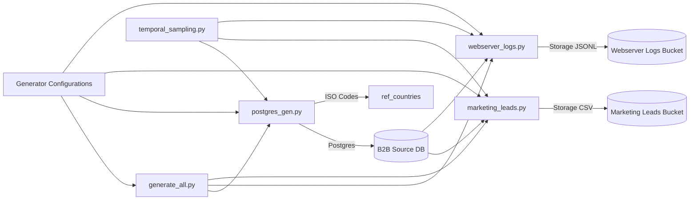
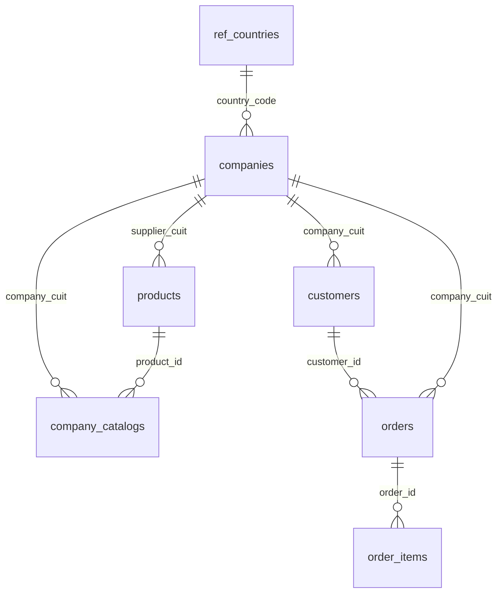
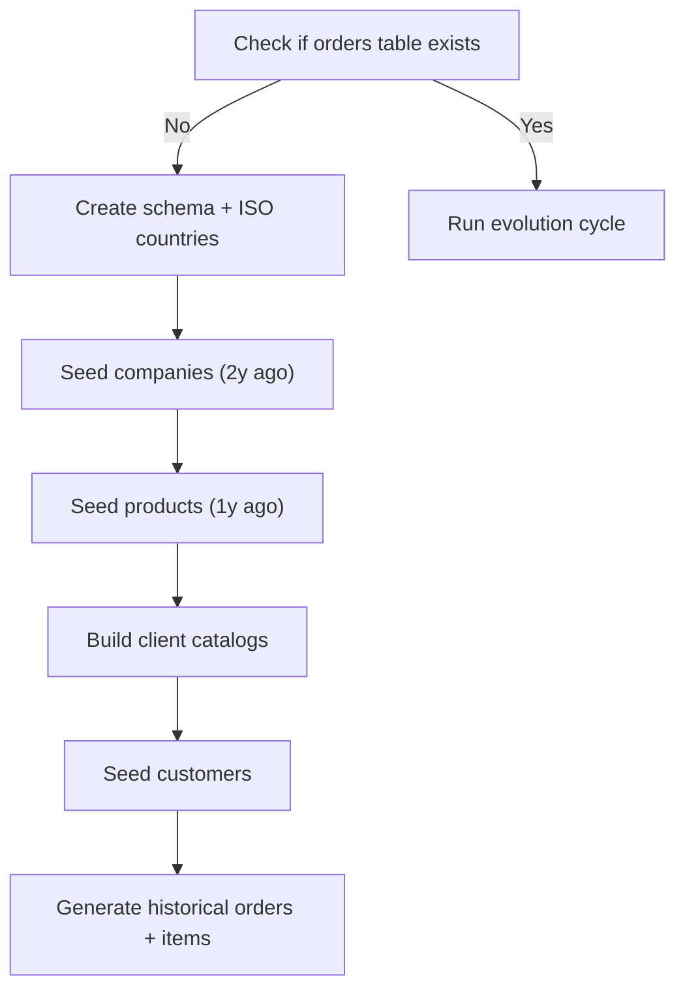
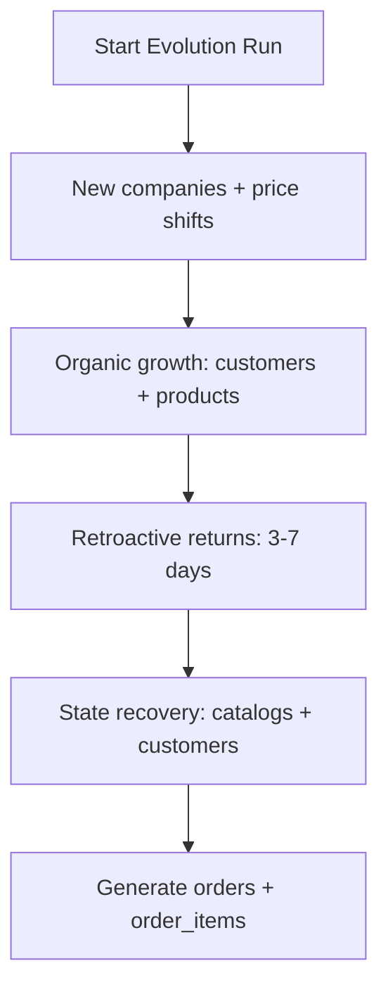
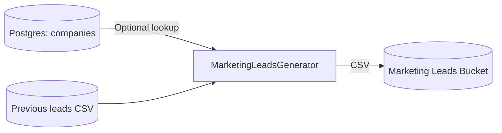
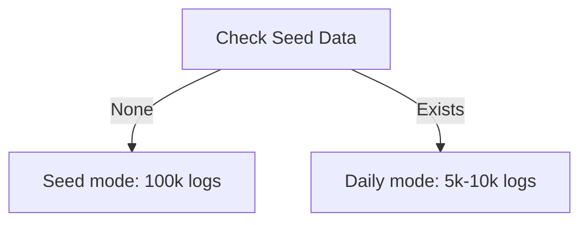
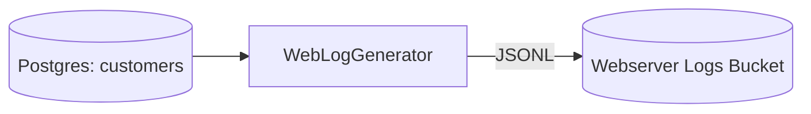

# B2B Data Sources: Generation and Evolution
[](https://img.shields.io/)
[](https://img.shields.io/)
[](https://img.shields.io/)

This package provides data generators for the B2B ecommerce platform. It creates a relational baseline in Postgres and emits supporting marketing leads and webserver logs to the configured storage system. The result is a realistic, evolving dataset that is consistent across sources.

## Why This Matters

Business value:
1. Simulates real-world B2B growth: new companies, new products, pricing changes, and returns.
2. Enables sales, marketing, and operations analytics without needing production data.
3. Supports demos and stakeholder reviews with consistent, believable scenarios.

Data value:
1. Produces clean, joinable sources for ETL, dbt, and warehouse modeling.
2. Exercises observability, data quality checks, and anomaly detection.
3. Provides repeatable volumes for performance testing and pipeline hardening.

## How It Works (Simple)

1. Seed the relational baseline in Postgres if it does not exist.
2. On later runs, evolve the same dataset with new entities, pricing shifts, returns, and seasonal volume.
3. Generate webserver logs and marketing leads tied back to Postgres entities.
4. Reuse a shared temporal sampling engine so timestamps and day-level volumes look realistic across generators.

## Architecture Overview



## Configuration

Required Postgres environment variables:
1. `POSTGRES_HOST`
2. `POSTGRES_PORT`
3. `POSTGRES_USER`
4. `POSTGRES_PASSWORD`
5. `POSTGRES_DATABASE`
6. `POSTGRES_SSLMODE` (optional, default `prefer`; set `require` for Aiven)
7. `POSTGRES_SSLROOTCERT` (optional, CA path for `verify-ca` / `verify-full`)

### Aiven Postgres Example
Recommended `.env` shape for Aiven Cloud:
1. `POSTGRES_HOST=<your-aiven-host>`
2. `POSTGRES_PORT=<your-aiven-port>`
3. `POSTGRES_USER=<your-aiven-user>`
4. `POSTGRES_PASSWORD=<your-aiven-password>`
5. `POSTGRES_DATABASE=<your-aiven-db>`
6. `POSTGRES_SSLMODE=require`

Storage configuration:
1. `STORAGE_LOCATION` (local, minio, s3, gcs)
2. `STORAGE_MINIO_ENDPOINT_URL` or `STORAGE_S3_ENDPOINT_URL` (if applicable)
3. `STORAGE_MINIO_ROOT_USER` or `STORAGE_S3_ACCESS_KEY_ID`
4. `STORAGE_MINIO_ROOT_PASSWORD` or `STORAGE_S3_SECRET_ACCESS_KEY`

Default buckets:
1. Webserver logs: `b2b-ec-webserver-logs`
2. Marketing leads: `b2b-ec-marketing-leads`

Generator tuning (env prefixes):
1. Marketing leads: `MARKETING_LEADS_*`
2. Webserver logs: `WEB_LOGS_*`
3. Geography and trade realism: `GEO_*`

### MinIO Quick Setup

```bash
# from repository root
docker compose up -d minio
uv run python packages/b2b_ec_utils/src/b2b_ec_utils/storage.py
```

MinIO endpoints:
1. API: `http://localhost:9000`
2. Console: `http://localhost:9001`

## Generator: Relational Source DB (`postgres_gen.py`)

Purpose: Seed and evolve the core relational dataset in Postgres. This is the primary source of truth for companies, products, catalogs, customers, and orders.

### Schema Created

Tables:
1. `ref_countries` (ISO codes)
2. `companies` (Supplier/Client)
3. `products`
4. `company_catalogs` (per-client catalogs and sale prices)
5. `customers`
6. `orders` (with status and audit timestamps)
7. `order_items`



### Seed Phase (First Run)

When the `orders` table does not exist, the generator performs a full historical seed:
1. Creates schema and inserts all ISO country codes.
2. Generates companies two years in the past.
3. Generates products one year in the past.
4. Builds per-client catalogs with markups.
5. Generates customers across the client base.
6. Generates historical orders and order items.

Defaults (can be adjusted in `postgres_gen.py`):
1. 100 companies
2. 10,000 customers
3. 700 products
4. 100,000 orders
5. 250 catalog items per client



### Evolution Phase (Subsequent Runs)

If the schema exists, each run simulates a "market day":
1. New companies can appear (client or supplier).
2. Supplier price shifts cascade into client catalog prices.
3. Organic growth adds new customers and new products.
4. Some completed orders from 3-7 days ago are marked as returned.
5. New orders and order items are generated from current state.
6. Daily order volume is seasonally sampled (default range target: 100-450).

### Geography and Trade Realism

The relational generator now uses a statistically modeled geography strategy:
1. Company country assignment is weighted: about 80 percent in top economies and 20 percent in the rest.
2. Controlled noise is applied to shares and weights each run (bounded jitter, then renormalization).
3. Catalog construction uses trade lanes, not flat random links:
4. Domestic lane (default 50 percent)
5. Regional lane (default 30 percent)
6. Global lane (default 20 percent)

This keeps country concentration realistic while preserving import/export style product flow.



### Operational Notes

1. Bulk loads use `COPY FROM` for speed.
2. Audit fields (`created_at`, `updated_at`) are initialized and updated on price shifts and returns.
3. Orders are always generated after customer creation to prevent time-travel.

## Generator: Marketing Leads (`marketing_leads.py`)

Purpose: Generate B2B marketing leads as CSV files in the configured storage system.

Key behavior:
1. By default, about 70 percent of new leads map to existing client companies (when available).
2. Seed mode creates a historical baseline; daily mode carries over a subset of prior leads and advances statuses.
3. Lead sources and statuses simulate a realistic B2B funnel.
4. Existing-company leads inherit the company country; new prospects use weighted geography sampling.
5. Contact names and phone numbers are localized from country-to-locale mapping.
6. Country codes align with Postgres `ref_countries` for clean joins.
7. Lead timestamps and daily lead volume follow monthly seasonality plus jitter.



Output fields include:
1. Lead and company identifiers
2. Contact name, email, and phone
3. Lead source and status
4. Estimated annual revenue
5. Country code

Storage location:
1. Bucket: `b2b-ec-marketing-leads`
2. Prefix: `marketing/`
3. Filename: `b2b_leads_YYYYMMDD_HHMMSS.csv`

## Generator: Webserver Logs (`webserver_logs.py`)

Purpose: Generate structured JSONL access logs tied to real customer accounts.

Seed vs daily behavior:
1. If no seed logs exist, it generates a large historical seed file.
2. If seed logs exist, it generates a smaller daily increment with seasonal volume sampling.



Log semantics:
1. Logs are created only for valid customer usernames.
2. About 10 percent of traffic is unauthenticated.
3. Authenticated traffic is biased toward returning users while still sampling recent new users.
4. Endpoints and status codes are weighted for realistic production traffic.
5. IP addresses are country-aware: authenticated traffic follows customer country; unauthenticated traffic follows weighted country sampling.
6. Timestamps always occur after the corresponding customer account creation time.



Storage location:
1. Bucket: `b2b-ec-webserver-logs`
2. Prefix: `seed/` or `daily/`
3. Filename: `access_YYYYMMDD_HHMMSS.jsonl`

## How To Run (Simplified)

Recommended one-shot:
```bash
uv run python packages/b2b_ec_sources/src/scripts/generate_all.py
```

Geography validation:
```bash
uv run python packages/b2b_ec_sources/src/scripts/validate_geography.py
```

Individual commands:
```bash
# 1) Seed or evolve the relational database
uv run python -m b2b_ec_sources.postgres_gen

# 2) Generate webserver logs
uv run python -m b2b_ec_sources.webserver_logs

# 3) Generate marketing leads
uv run python -m b2b_ec_sources.marketing_leads
```

Recommended order:
1. Postgres generator first (companies and customers must exist).
2. Webserver logs (reuses customers).
3. Marketing leads (reuses companies when available and can carry over prior day status).

## How To Use This Package (Business and Data)

Business use cases:
1. Sales funnel analytics and lead conversion simulation.
2. Pricing impact analysis from supplier cost changes to client markups.
3. Customer lifecycle and churn modeling with returns and cancellations.

Data and engineering use cases:
1. Build and validate ETL pipelines with consistent joins.
2. Test data quality rules and observability alerts.
3. Benchmark warehouse and query performance under realistic load.

Practical workflow:
1. Run the Postgres generator to seed or evolve the baseline.
2. Generate leads and logs to create multi-source inputs.
3. Use these sources to develop dashboards, models, and pipelines without production risk.

## Evolution Logic: Intuition and Real-World Parallels

The evolution cycle is designed to mirror how B2B systems behave in production:

1. New entities appear intermittently.
   Real systems gain new suppliers and clients over time. This drives schema growth and catalog expansion.
2. Prices change and cascade.
   Wholesale price shifts ripple into downstream contracts and catalogs. This is common in procurement and contract pricing.
3. Growth is steady, not explosive.
   Customer acquisition and product expansion happen gradually, matching typical business growth curves.
4. Returns are delayed.
   Returns and cancellations do not happen instantly; they show up days later after delivery and inspection.
5. Logs track reality, not ideals.
   Web traffic includes bots, failed requests, and non-authenticated sessions, which reflect what real systems see daily.

This is why the engine mixes deterministic rules (referential integrity, time ordering) with probabilistic events (new companies, price shifts, returns). It creates data that behaves like a live system, not just a static fixture.

## Troubleshooting

1. If Postgres connections fail, verify `.env` and ensure the DB is reachable.
2. If storage writes fail, verify `STORAGE_LOCATION` and bucket credentials.
3. If seed logs never switch to daily mode, check if the `seed/` prefix exists in the target storage bucket.
